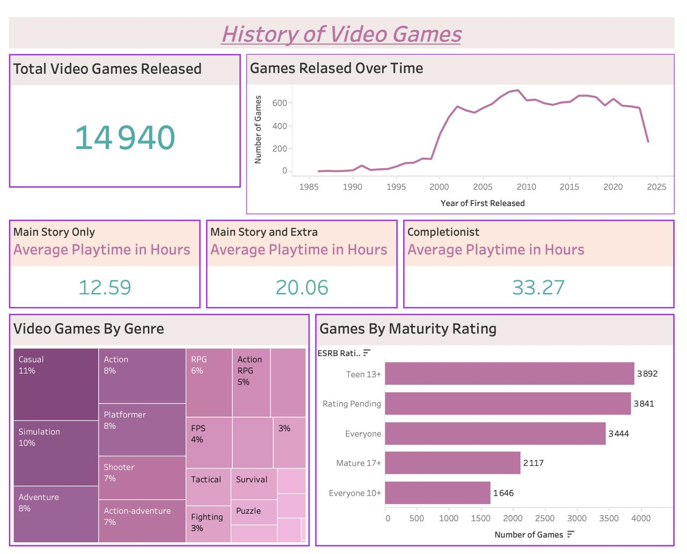

# 🎮 Video Games Dashboard (Tableau)

This project explores the **history of video games** using interactive visualizations built in **Tableau**.  
The dashboard analyzes trends in game releases, playtime behavior, genres, and maturity ratings.

## 📊 Dashboard Preview

## 🔍 Key Insights

- **Total Video Games Released:** 14,940 games analyzed.
- **Game Releases Over Time:** Significant growth in the number of games released after the early 2000s.
- **Average Playtime:**
  - Main Story Only: **12.59 hours**
  - Main Story + Extras: **20.06 hours**
  - Completionist: **33.27 hours**
- **Genre Distribution:** Casual, Simulation, and Adventure are among the most common genres.
- **Maturity Ratings:** Teen (13+) and Rating Pending represent the largest share of games.

## Tools Used

- **Tableau** – Data visualization and dashboard creation  
- **Data Analysis** – Exploring game trends and player behavior

## Project Files

- `video_games_dashboard.twbx` – Tableau packaged dashboard
- `Video-Games-Dashboard.png` – Dashboard preview image
